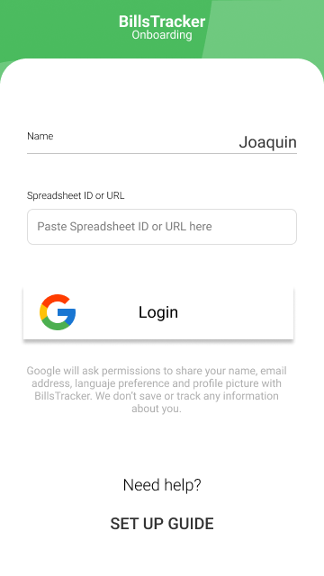

<h1 align="center">Bills Tracker</h1>

### This is a project based on a progressive web app to Track and share expenses with Google Drive spreadsheet in a very simple way. Currently working on a new version!.

  
  
  
  

## Table of Contents

- [Objectives](#Objectives)
- [Screenshots](#Screenshots)
- [Architecture](#Architecture)
- [Onboarding](#Onboarding)
- [Example](#Example)
- [Next steps](#Next-steps)
- [Author](#Author)
- [Contributors ✨](#Contributors-✨)

## Objectives

- Save bills to a spreadsheet quickly and easily
- Separate types of expenses
- Show all the records with graphs
- Allow use by more than one user on the same spreadsheet
- Recognize where your money goes!

## Screenshots

  
  
  
  
   
  

## Architecture

## Onboarding

### 1. Create a spreadsheet and share it

Share your spreadsheet with link sharing: _Anyone with th link can edit_.

### 2. Copy spreadsheet ID

For example, on `https://docs.google.com/spreadsheets/d/1qffzsCf2siRv-loAAMLeGzsSsmwcT3odSfmXBASO0fg/edit#gid=0` the ID is `1qffzsCf2siRv-loAAMLeGzsSsmwcT3odSfmXBASO0fg`.

### 3. Generate JSON file

#### Set up project and enable sheets API

1. Go to the [Google Developers Console](https://console.developers.google.com/)
2. Select your project or create a new one (and then select it)
    
   
3. Enable the Sheets API for your project
4. In the sidebar on the left, select APIs & Services > Library  
   
5. Search for "sheets"
6. Click on "Google Sheets API"
7. click the blue "Enable" button

#### Create a service account for your project

1. In the sidebar on the left, select APIs & Services > Credentials
2. Click blue "+ CREATE CREDENITALS" and select "Service account" option  
   
3. Enter name, description, click "CREATE"
4. You can skip permissions, click "CONTINUE"
5. Click "DONE"
6. Click the name of your credential
7. Go to keys
8. Select Add key > Create new key  
   
9. Click "DONE"

## Example

- I have a functional example on [Netlify](https://sleepy-bhaskara-080018.netlify.com/)

## Next steps

- [x] Validate inputs
- [x] Show graphs
- [x] Editable expense type dropdown values
- [ ] Improve the code

## Author

**Joaquin Beceiro**

- [GitHub](https://github.com/JoaquinBeceiro)
- [Web](https://JoaquinBeceiro.com.uy)

## Contributors ✨

<table>
  <tr>
    <td align="center"><a href="https://github.com/GFPdu"> <b>GFPdu</b></a></td>
  </tr>
</table>
