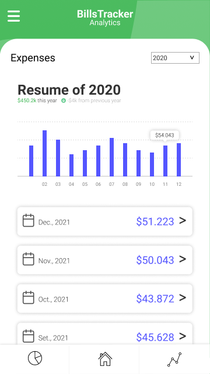

<h1 align="center">Bills Tracker</h1>
<p align="center">
  
</p>

### This is a project based on a progressive web app to Track and share expenses with a Google Drive Spreadsheet in a very simple way.

<p align="center">
  
  
  
  
</p>

## Table of Contents

- [Objectives](#Objectives)
- [Screenshots](#Screenshots)
- [Architecture](#Architecture)
- [Development Requirements](#development-requirements)
- [Onboarding](#Onboarding)
- [Information](#Information)
- [Example](#Example)
- [Next steps](#Next-steps)
- [Author](#Author)
- [Contributors ✨](#Contributors-✨)

## Objectives

- Save bills to a spreadsheet quickly and easily
- Separate types of expenses
- Show all the records with graphs
- Share your expenses with others on the same spreadsheet
- Identify how are you spending your money!

## Screenshots

<p float="left">
  
  
  
  
   
  
  
</p>

## Architecture


## Development Requirements

_These instructions will allow you to obtain a copy of the running project on your local machine for development and testing purposes._

_The first thing you need to do is create a fork of this project and clone it. To start using the software it is only necessary to have [Node.js](https://nodejs.org/en/download) installed on your system._

_Once the fork is cloned and Node installed.js on your system, you can install the project dependencies by following these steps;_

_Installs project dependencies_

```
npm install
```

_Add an .env file to the project root and enter your credentials_

```
touch .env
```

```
REACT_APP_REDIRECT_URI=<REACT_APP_REDIRECT_URI>
REACT_APP_BASE_URI=<REACT_APP_BASE_URI>
REACT_APP_GOOGLE_OAUTH_CLIENT_ID=<REACT_APP_GOOGLE_OAUTH_CLIENT_ID>
REACT_APP_GOOGLE_OAUTH_CLIENT_SECRET=<REACT_APP_GOOGLE_OAUTH_CLIENT_SECRET>
```

_Run the project_

```
npm start
```

## Onboarding

### 1. Create a spreadsheet

- Create a new Google Spreadsheet or copy from [here](https://docs.google.com/spreadsheets/d/1zR8NCRoiVZszVN1FlqUdSk9r9jfn_h_eR3gYCgJuvqY/copy).
- Copy the spreadsheet ID or URL, you will need it later.
- The ID is on the URL of the spreadsheet.
  https://docs.google.com/spreadsheets/d/1qffzsCf2siRv-loAAMLeGzsSsmwcT3odSfmXBASO0fg/edit#gid=0. You can also use the full URL.

### 2. Onboarding process

#### Insert data into onboarding fields.

- Insert you name in the "NAME" field
- Insert the spreadsheet ID or URL
- Click "Login" and magic!

## Information

**You can use the app with shared data if 2 or more users enter the same SpreadsheetID/URL using different names.**

BillsTracker don’t save or track any information about you.
All the data entered in the application belongs only and solely to the user, BillsTracker does not store any type of information since we do not have a database to do so.
The code of the app is public and open source, we don’t have any back-end, it’s just front-end.

If you want to collaborate or support the project in any way, feel free to do so through the GitHub profile

## Example

- I have a functional example on [Netlify](http://pwa.billstracker.app/)

## Next steps

- [x] Validate inputs
- [x] Show graphs
- [x] Editable expense type dropdown values
- [ ] Improve the code

## Author

**Joaquin Beceiro**

- [GitHub](https://github.com/JoaquinBeceiro)
- [Web](https://JoaquinBeceiro.com.uy)

## Contributors ✨

<table>
  <tr>
    <td align="center"><a href="https://github.com/GFPdu"><br /><sub><b>GFPdu</b></sub></a></td>
    <td align="center"><a href="https://github.com/DerOrangeBaron"><br /><sub><b>DerOrangeBaron</b></sub></a></td>
    <td align="center"><a href="https://github.com/SirMendacium"><br /><sub><b>SirMendacium</b></sub></a></td>
  </tr>
</table>

## Expressions of gratitude 🎁

* Tell others about this project 📢
* Invite someone on the team for a beer 🍺 or coffee ☕. 
* Give thanks publicly 🤓.
* Star to the project ⭐
